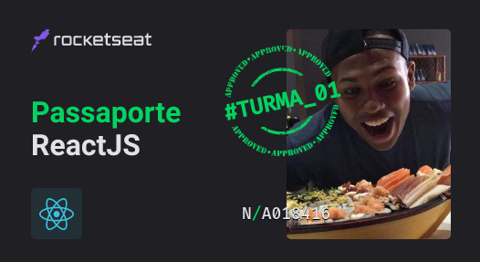
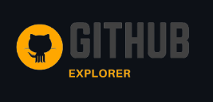
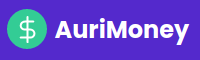
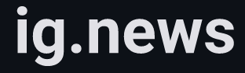

   

   

  

> Repositorio com projetos do curso de ReactJs da Rocketseat bootcamp #ignite01  [Rocketseat](https://github.com/Rocketseat).

# :pushpin: Conteúdo

- [Projetos](#rocket-projetos)
  - [Github Explorer](#github-explorer)
  - [AuriMoney (DT Money)](#dt-money)
  - [ig.news](#ignews)
- [Desafios](#atom_symbol-desafios)
  - [Chapter I](#one-chapter-i)
  - [Chapter II](#two-chapter-ii)
  - [Chapter III](#two-chapter-iii)
- [Autores](#computer-autores)
- [Licença](#closed_book-licença)

# :rocket: Projetos

### Github Explorer

  

### AuriMoney (DT Money)

  

### ig.news

  

# :atom_symbol: Desafios

## :one: Chapter I

[Desafio 1](https://github.com/AurinoJunior/Ignite-reactjs/tree/master/Desafios/01-to-do): Desafio sobre os conceitos.

## :two: Chapter II

[Desafio 3](https://github.com/AurinoJunior/Ignite-reactjs/tree/master/Desafios/02-create-hook-cart): Desafio de criando um hook para carrinho de compras.

[Desafio 4](https://github.com/AurinoJunior/Ignite-reactjs/tree/master/Desafios/03-refactoring-js-ts): Desafio transaformadno JS em TS e Class em Functional Components.

## :two: Chapter III

[Desafio 3](https://github.com/AurinoJunior/Ignite-reactjs/tree/master/Desafios/04-criando-um-blog): Nesse desafio criei do zero uma aplicação de um blog com Prismic CMS a partir e um layout do Figma

# :computer: Autores

<table>
  <tr>
    <td align="center">
      <a href="https://www.linkedin.com/in/aurino-junior-7718a4158/">
        
         
        
          <b>Aurino Junior</b>
        
      </a>
       
       
      
Dev e dono do repo  🚀🚀

       
    </td>
    <td align="center">
      <a href="https://www.linkedin.com/in/tavareshenrique/">
        
         
        
          <b>Henrique Tavares</b>
        
      </a>
       
       
      
O brabo que deu a ideia   inicial desse repo 🔥

       
    </td>
    <td align="center">
      <a href="http://github.com/rocketseat/">
        
         
        
          <b>Rocketseat</b>
        
      </a>
       
       
      
Escola  ❤️❤️

       
    </td>
  </tr>
</table>

# :closed_book: Licença

Este projeto está sob a licença [MIT](./LICENSE).
